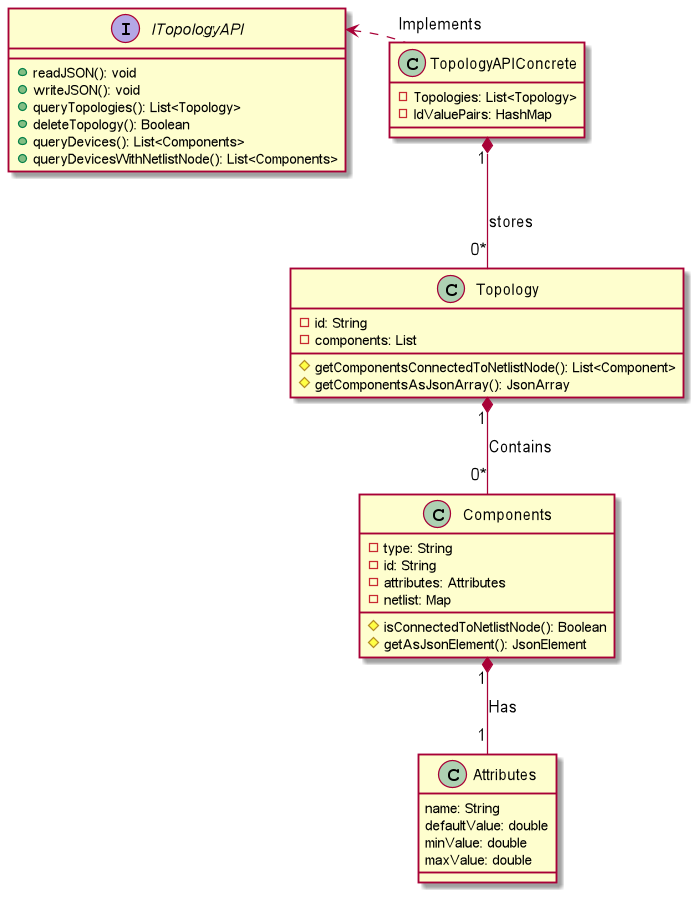

# Topology API Task

[Documentation](http://karimelsayad.me/MasterMicroTopologyAPI/TopologyAPI.html)

Written in Java. Reasons I chose java include:

* Java is an Object-Oriented language, suitable for the required task.

* All pointers are essentially smart pointers, no need to think about memory management.

* The requirement excluded Python. I take this as excluding all dynamic interpreted languages, 
this meant I had to exclude Ruby and Javascript too.

I'm using IntelliJ IDE, which integrates great code analysis tools. I'm using Maven build tool.

## Assumptions

This implementation assumes few things:

* Each json file contains only 1 topology.
* Each topology will be written to a separate json file.
* The id, type, and netlist properties exist for all components.
* The attribute properties must include, and only include: default, min, and max.
* Anything not specified here should be provided exactly as the example topology.json received with task
* The fileName arguments to readJSON and writeJSON should contain the relative path from the present working directory to the json file.
* The specs don't mention a function to check for existence of a topology, thus the next two assumptions (More is bad,
according to non-functional requirements)
* Delete method doesn't raise errors, but returns false if element to delete doesn't exist
* queryComponents method doesn't raise error, and returns null if topology not found
* bad json files raise exceptions. User should make sure files are correct. 

## Challenges faced

* The name of the attribute property is dynamic (resistance, m(l), etc...).
This meant I had to implement my own custom JSON deserializer.
Dynamic properties are impossible with java, this meant I had to rethink the design of my classes.
* There was a typo in topology.json! After scratching my head with a weird null pointer exception, it turned out that
the "default" property for value of nmos was written as "deafult". I assume this is a typo.

## Documentation

Detailed docs [Can be found here](http://karimelsayad.me/MasterMicroTopologyAPI/TopologyAPI.html).

Below is a simple UML diagram representing the class structure

